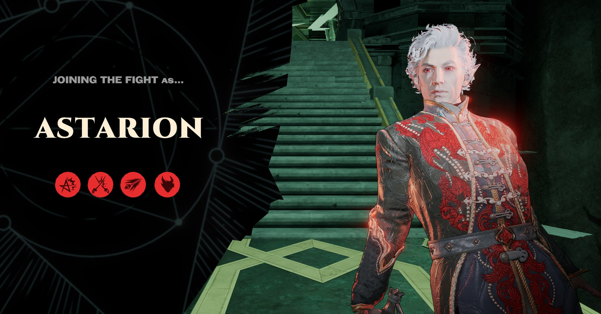
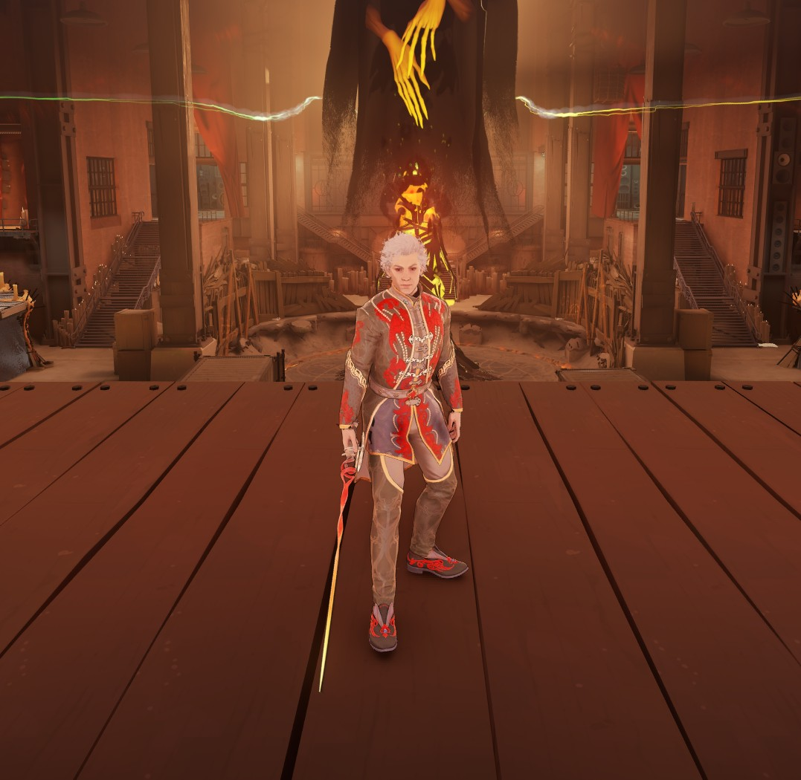
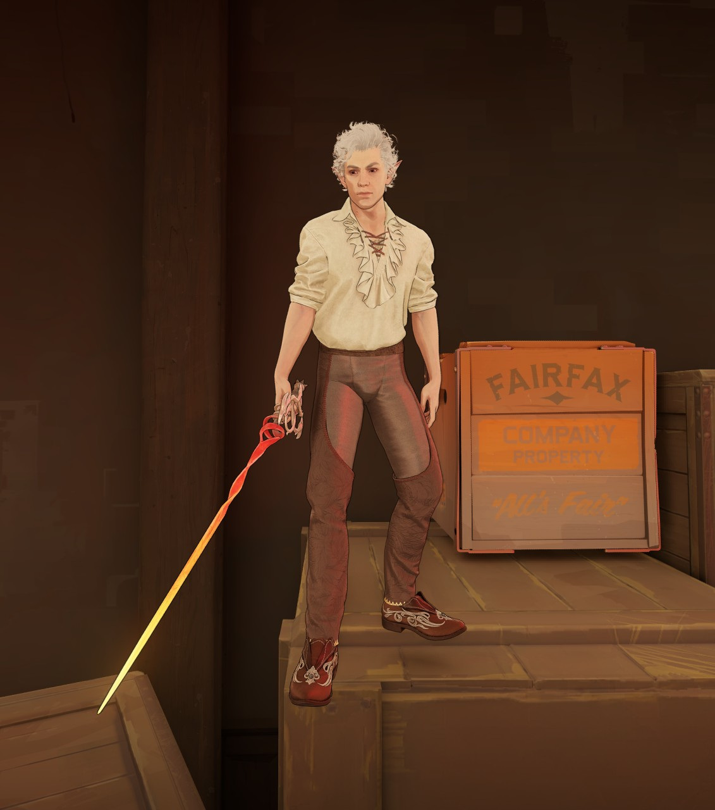
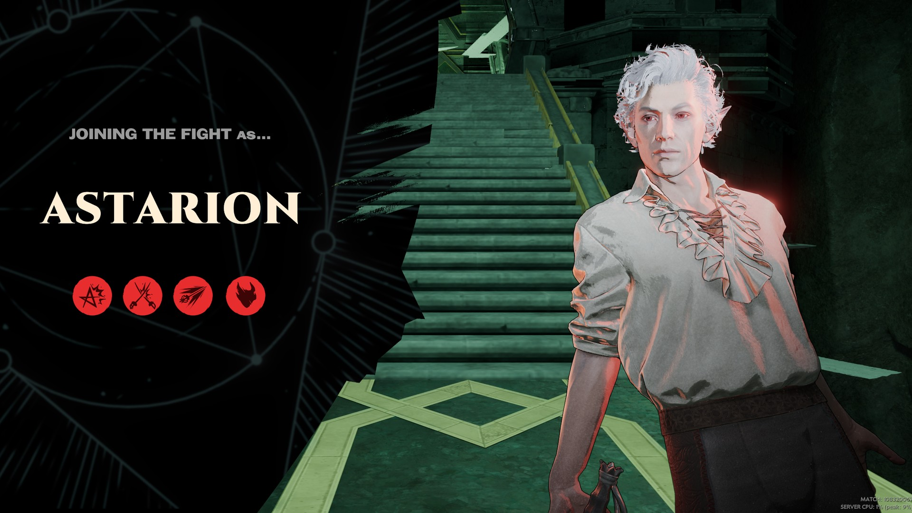

# Astarion-Apollo

Astarion from *Baldur's Gate 3*, replacing Apollo in [Deadlock](https://store.steampowered.com/app/1422450/Deadlock/). Two outfits: his camp clothes and the Ascended epilogue outfit.



## Features

- Astarion's model from *Baldur's Gate 3*, rigged to Apollo, with his exact in-game skin, hair and eye colours
- Two outfits, one download each: **Camp** and **Ascended**
- The Ascended coat has real cloth physics: the coattails swing and settle as he moves
- The Infernal Rapier replaces Apollo's rapier
- 788 of Apollo's voice lines replaced with Astarion's, plus 157 extra lines for variety (the ult cycles through his Latin incantations). Hero-specific pings keep Apollo's voice so callouts stay clear.
- Custom hero-select scene in the Ascension ritual chamber, with a new pose (also on the main menu and post-game screen)
- Hero cards, portraits, icons, weapon art and an ASTARION name title

Apollo's abilities are unchanged.







## Install

Pick **one** outfit: both replace Apollo.

1. Download `Astarion-Apollo-Camp.zip` or `Astarion-Apollo-Ascended.zip` from the [latest release](../../releases/latest) and extract `pak03_dir.vpk`.
2. Open `Deadlock\game\citadel\gameinfo.gi` and add this line inside `SearchPaths`, above `Game citadel`:
   ```
   Game                citadel/addons
   ```
3. Put the VPK in `Deadlock\game\citadel\addons\`. Create the folder if it doesn't exist.
4. Launch the game and pick Apollo.

Game updates can reset `gameinfo.gi`. If the mod stops loading, add the line again. Deadlock Mod Manager users can install it from GameBanana with one click.

## Known issues

- Ascended: his trousers can poke through the coat slightly in some poses.
- Hero-specific ping callouts use Apollo's voice on purpose.

## Credits

Astarion and *Baldur's Gate 3* belong to Larian Studios. The model, outfits, rapier, scene and voice lines (Neil Newbon) come from the game. Deadlock belongs to Valve. This is a free fan mod and isn't affiliated with either.
